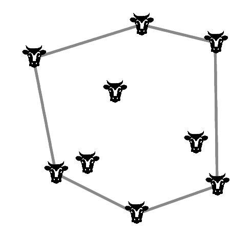
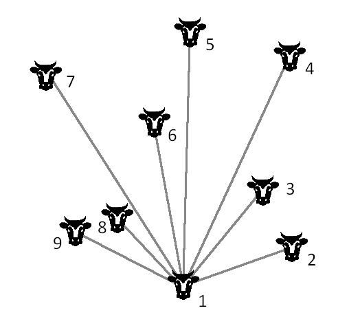
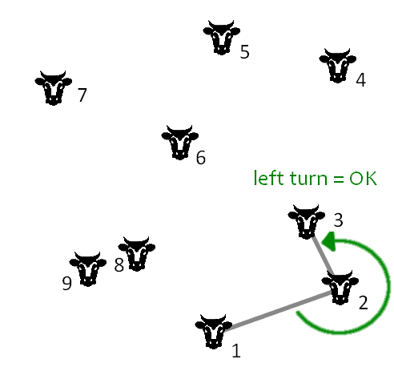
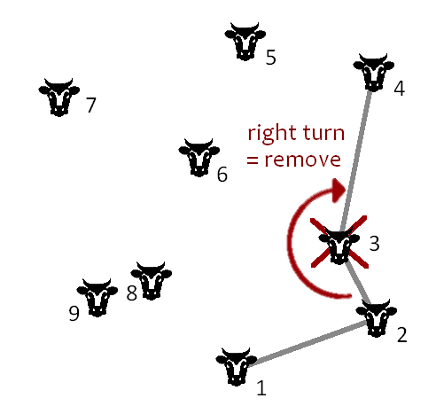

# Coding Challenge: How many corners does a herd of cows have?

Imagine a herd of cows standing on a range. You, the cowboy, are to catch all of them with a single throw of your lasso. Once you pull the rope tight, you will find some cows at the corners, holding the lasso *straff*, others are in the middle. The question is, how many cows are there standing at the corners?

A proper cowboy should have no problem with counting the cows at the corners before they start to move around and mess up everything. To implement this on a computer seems a lot harder. The problem is called finding the **Convex Hull**.

Your challenge is to implement a program that identifies the cows at the corners in 2D.

## Sample data

    POINTS = [
              ('A', 3, 9), ('B', 11, 1), ('C', 6, 8),
              ('D', 4, 3), ('E', 5, 15), ('F', 8, 11),
              ('G', 1, 6), ('H', 7, 4), ('I', 9, 7),
              ('J', 14, 5), ('K', 10, 13), ('L', 16, 14),
              ('M', 14, 2), ('N', 13, 16), ('O', 3, 12),
              ('P', 12, 10)
             ]

## The Graham Algorithm for calculating the convex hull

The Graham Algorithm is one possible approach to the problem. Below, you find its steps lined out.

### Step 1: Find one Cow at a corner

The idea of the algorithm is to find one cow standing at a corner first. For instance, you could start with the cow closest to the Rio Grande, that is the southernmost one. We know that this cow is part of the convex hull.

Then, the algorithm moves around the herd in a circle, examining all other cows whether they are at a corner or not. All found corners are memorized and returned at the end. 

### Step 2: Sort the other cows by angles

When starting at the southernmost cow, you can construct rays from this first cow to all other cows, and calculate the angle to the east-west horizontal. When sorting the cows by these angles, it becomes easy to walk around the herd in counter-clockwise fashion.

### Step 3: Distinguish right and left turns

The biggest challenge is to find out, whether a given cow belongs to the convex hull or not. For this, it is necessary to consider the two adjacent cows as well. If these three points describe a left turn, the middle cow is part of the convex hull.

If you find a right turn instead, the algorithm has found a dent in the hull. This means that the middle one of the three cows is not touching the lasso, because it is in the middle of the herd. It needs to be removed from the complex hull.

## What else?

The Graham algorithm for calculation of the convex hull belongs to large family of elementary geometrical algorithms like the intersection of two lines, the nearest point, and the Delaunay-triangulation. It has practical significance in e.g. the lasso function in GIMP or Photoshop. In structural bioinformatics, the complex hull has importance as well.

Also see: Robert Sedgewick, Algorithms in C++; Addison-Wesley 1992
