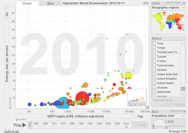
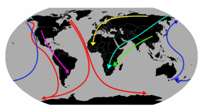

# 10 Datenquellen für den Unterricht

## 1. Babynamen

Die US-Meldebehörden veröffentlichen Jahr für Jahr ein Verzeichnis der Vornamen der im Land geborenen Babys. In diesem einsteigerfreunlichen Datensatz findet sich so manche Überraschung, z.B. Namen von Prominenten im Verlauf der Zeit.

## 2. Globale Demographie

**Hans Rosling**, der kürzlich verstorbene Gründer der **[Gapminder Foundation](http://gapminder.org/)** hat mit seinen Vorträgen Maßstäbe in der Darstellung komplexer Daten gesetzt. Mit dem reichhaltigen Daten zu Bevölkerung, Gesundheit und Wohlstand, die als Excel-Downloads frei verfügbar sind, kann jeder selbst untersuchen was in den Ländern der Erde im Verlauf der Zeit passiert ist.

Weitere demographische Daten finden sich in der **[World Inequality Database](http://wid.world/)** und auf **[Our World in Data](http://ourworldindata.org/)**.

## 3. Flugzeugabstürze

Eine Datenbank aller Abstürze in der zivilen Luftfahrt findet sich auf [www.planecrashinfo.com](http://www.planecrashinfo.com). Ein kleiner aber feiner Datensatz für diejenigen, die mit Geodaten experimentieren möchten. Von **Dinu Gherman** gibt es eine [Adaption des Datensatzes unter Python](http://www.github.com/deeplook/notebooks/blob/master/planecrashinfo).

## 4. Wandervögel

Auf [ebird.org](http://ebird.org/ebird/explore) findet sich ein Datensatz mit aufgezeichneten Vogelwanderungen. Wem das unspannend vorkommt, der möge sich das 30-Sekunden Video dazu auf [www.allaboutbirds.org](https://www.allaboutbirds.org/mesmerizing-migration-watch-118-bird-species-migrate-across-a-map-of-the-western-hemisphere/) ansehen.

 
## 5. Überlebenschancen auf der Titanic

Die komplette Passagierliste des Luxusdampfers mit der Information wer überlebt hat gilt als Klassiker für Einsteiger der Datenanalyse. Auf der Seite ["Titanic: Machine Learning from Disaster"](https://www.kaggle.com/c/titanic) findet sich eine Beschreibung der Titanic als maschinelles Lernproblem.

## 6. Das Wetter

Eine [Analyse europäischer Wetterdaten](https://github.com/alvaro-alonso/talks/tree/master/pandas) von **Alvaro Alonso** bietet einen soliden Einstieg in die Datenanalyse mit **Python und pandas**.

## 7. NCBI

Wer sich für den Life-Science-Bereich interessiert, kommt an den [NCBI Databases](http://ncbi.nlm.nih.gov/) nicht vorbei. Hier finden sich Gene, Proteine, wissenschaftliche Publikationen und vieles mehr. Die Webseite ist mit **[E-utilities](https://www.ncbi.nlm.nih.gov/books/NBK25500/)**, einer leistungsfähigen API zur Datenabfrage ausgestattet.

## 8. Terrorismus

Wer sich die Daten der [Global Terrorism Database](https://www.start.umd.edu/gtd/) im Verlauf der letzten Jahrzehnte ansieht, versteht vielleicht, warum diese Datenquelle auf einem abgeschlagenen Rang gelandet ist.

## 9. Offizielle Statistiken der Bundesregierung

Wem das noch nicht reicht, kann in den Beständen des [Statistischen Bundesamtes](https://www.destatis.de) fündig werden.

## 10. Und viele mehr..

Zu guter Letzt gibt es noch einen Haufen weiterer Datensätze zum Wühlen im [UCI Machine Learning Repository], beim [Journal of Statistical Education](http://www.stat.ufl.edu/~winner/datasets.html) und auf [dreamtolearn.com](https://dreamtolearn.com/ryan/1001_datasets).
