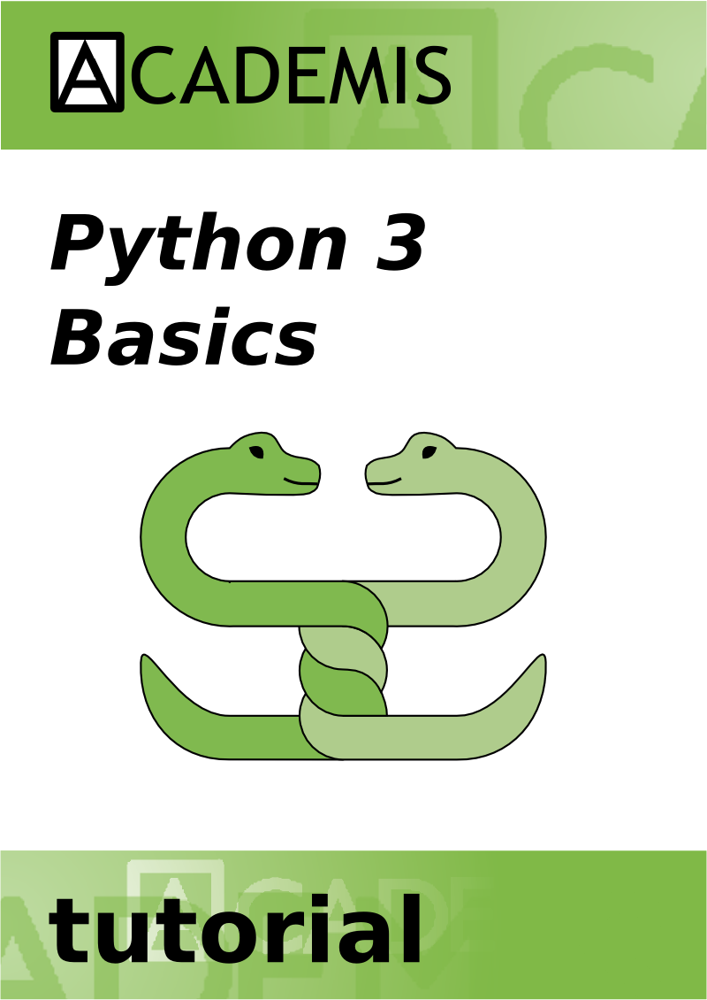

<h1>Tutorial: Python 3 Basics</h1>

<b>with contributions by Kristian Rother, Allegra Via, Kaja Milanowska and Anna Philips</b>

Course material for beginners of Python 3. The tutorial covers the basics of the language and is spiced up with interactive warm-up exercises and quiz questions after each section. 

<b><a href="http://www.gitbook.com/book/krother/python-3-basics-tutorial">Read or download exercises</a></b>  

<b><a href="http://www.gitbook.com/book/krother/python-3-reference">Read or download command reference</a></b>  

