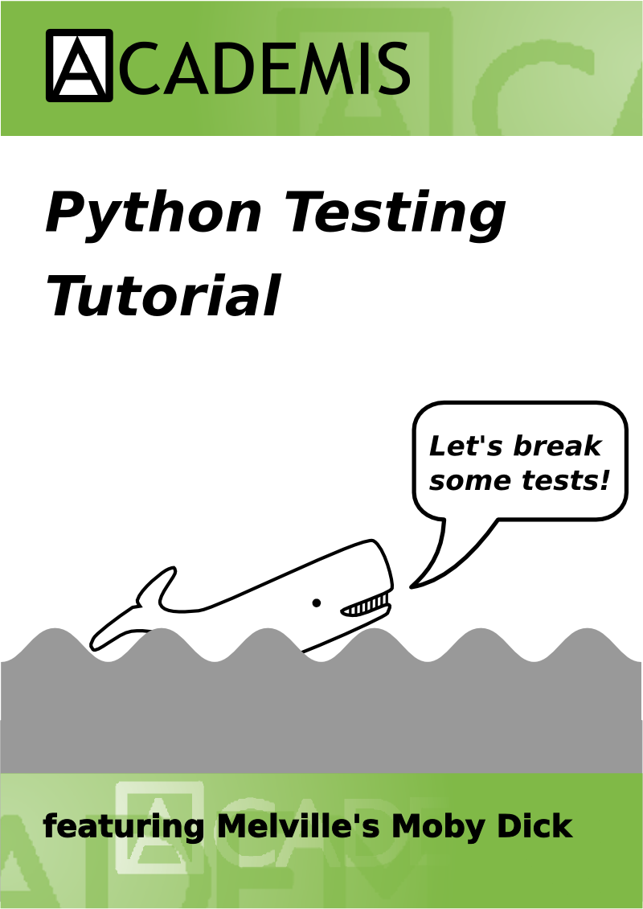

<h1>Tutorial: Python Testing</h1>

This toolkit helps you to learn automated testing with various frameworks in Python. It also contains a part on course preparation for trainers that allows you to adapt the material to your audience. 

<b><a href="https://www.gitbook.com/book/krother/python-testing-tutorial/details">Read or Download e-book</a></b>  
