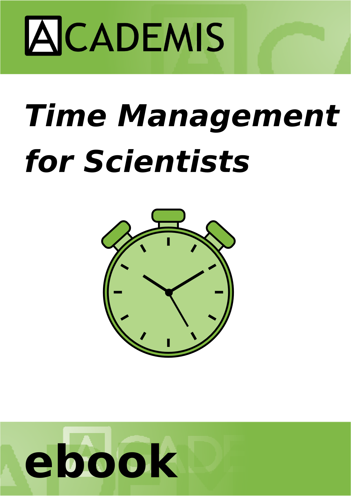

<h1>e-book: Time Management for Scientists</h1>

<b>with contributions by Kristian Rother, Allegra Via, Kaja Milanowska and Anna Philips</b>

This workshop handout covers basic time management techniques. Use it to get a first impression and try some of the methods described.

<b><a href="https://www.gitbook.com/book/krother/time-management-for-scientists/details">Read or Download e-book</a></b>  
