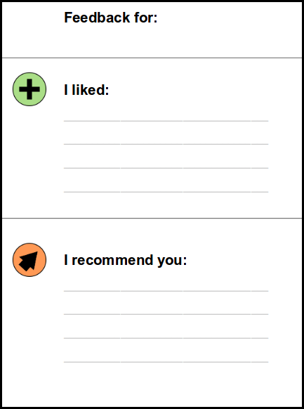

# Feedback Sheet for Presentations

Presenting at lab seminars helps all scientists to rehearse giving a scientific talk. To learn and improve quickly it is essential that they receive feedback on their presentations. However, open, critical feedback may quickly overwhelm the presenter even if it is meant to be constructive. In the end that may discourage someone from giving his or her best at the next presentation.

As an alternative, you can use a [Feedback Sheet [PDF]](files/feedback_sheet.pdf). Ask the audience to write down one good thing and one suggestion for the presenter:

### Pros and Cons

This form of feedback is more discrete than an open conversation. It gives the presenter a lot of information, and at the same time stays constructive - in every presentation there is something positive to find.

The disadvantage of the feedback sheet is that there is too little room for complex recommendations, e.g. how to best present a critical discussion of a paper. An alternative is to find a good presentation by an experienced lab member and ask him to explain afterwards how to do it.
