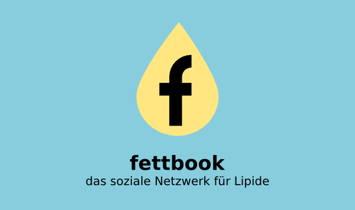

# fettbook - the Social Network for Lipids

[Download PDF in German](http://www.academis.eu/static/files/Fettbook.pdf)

Recently, I created new materials for my biochemistry lecture on lipids. I decided to let the lipids have a chat in their own social media channel. The outcome, in German **fettbook**, was very well received by students and critics alike. 

Some of them asked me: *"Kristian, how did you get this idea?"*

Of course, like many good ideas, it is stolen. Here are my teachers, the sources I *"borrowed"* from:

* In O'Reillys [**Head First**](http://www.headfirstlabs.com/) series of books, programming instructions and equations are chatting and arguing on a regular basis.
* In [**Data Science from Scratch**](http://shop.oreilly.com/product/0636920033400.do), Joel Grus introduces a social network for Data Scientists.
* In a seminar by [*Bill Monsour*](http://trainingartsinternational.com/), I witnessed the live use of dialogue and wanted to try it myself ever since. 

But none of them actually did any *Biochemistry* :-)

