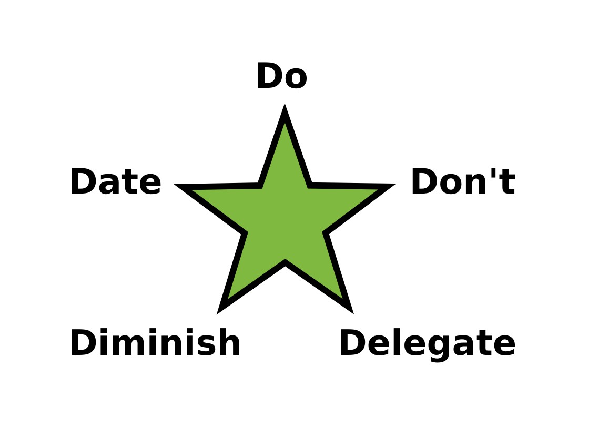

# Five Options

Whatever task is landing on your desk, you always have five options. Whether it is a part of your regular duties, an email, a piece of writing etc, the five options remain the same.

### 1. Do
The easiest. Simply start and get it done right away. It is tempting to treat this as your only option. However, if you do this all the time, you are asking for trouble.

### 2. Delegate
Find someone else to do the task. The bigger your team the more options you have. Even if you have nobody working for you directly you probably have some options.

### 3. Diminish
Apply the Pareto principle: Achieve 80% of the result with 20% of the work. Often it is not necessary to achieve 100%. For instance, if a task serves as a basis for communication with other people, leaving room for improvement can even stimulate the conversation.

### 4. Date
Set a date in your calendar. You don't have to do everything right away, but you should allocate some time to do it. Otherwise you may end up procrastinating the same task over and over.

### 5. Don't
The hardest option. Saying no is difficult. Usually nobody wants to put off another person. After all there was a reason why the task landed on your desk in the first place. See the next section for some hints on *how to say no*.

### Summary

The art of clever Time Management is to know your options, and to make decisions quickly. As a far eastern saying goes:

*A decision should not take longer than seven breaths.*

