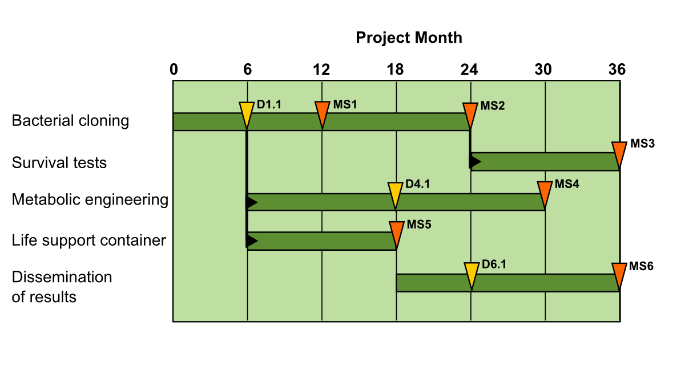

# GANTT Charts

GANTT charts are diagrams that show the start and end dates for the phases of a project. In grant applications, they are a concise way to show Milestones and Deliverables.

### What does the diagram contain?
Each horizontal bar represents a **Work Package** with a label on the left side. The orange wedges indicate **Milestones**, dates on which major portions of the project are expected to be finished. The yellow wedges are **Deliverables**, stepping-stones on the way. If a work package depends on another item to be completed, this is indicated by black vertical arrows.

### How to create GANTT charts?

You can create GANTT charts in MS Excel or OpenOffice. There are decent [online tutorials on Youtube](https://www.youtube.com/watch?v=-oD50HSBBBI). For more elaborate elements like the wedges indicating Milestones and Deliverables you can either post-process the graph in Photoshop or create the entire graph in a vector graphics program like [Inkscape](http://www.inkscape.org). For instance, I used Inkscape for the graph above.

### What does GANTT stand for?
It derives from *Henry Gantt*, who adapted it in the 1910's. A little earlier, in 1896, Karol Adamiecki applied the same kind of chart independently.
