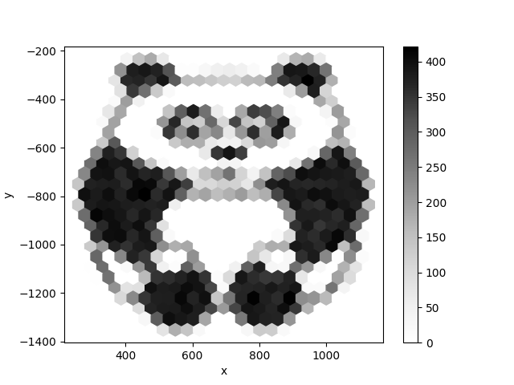

# Der Panda in der Honigwabe

Ich habe einen Panda in eine Honigwabe gesteckt:

**Bitte das Bild aus 3m Abstand betrachten. Bewegung vor dem Computer ist wichtig!**

Wie entsteht so ein Diagramm? Man nehme erstens ein schwarzweißes Bild, zum Beispiel von einem Panda. Zweitens braucht es folgendes **Python-Programm** mit den Bibliotheken **pandas**, **NumPy** und **matplotlib**:

    :::python
    import pandas as pd
    import pylab as plt
    import numpy as np
    import random
    from PIL import Image as im

    # Das Panda-Bild in Graustufen einlesen
    panda = im.open('panda.png')
    panda = panda.convert('L')

    width, height = panda.size
    gmap = list(panda.getdata())
    gmap = np.array(gmap)
    gmap = gmap.reshape((height, width))

    # Inverieren
    g = gmap - 255
    g = -1 * g

    # Weiße Punkte ausfiltern
    p = pd.DataFrame(g)
    pp = p.unstack()
    pp = pp[pp > 0]

    # bescheuerter Trick, noch zu optimieren
    pp.to_csv('panda.csv')
    pr = pd.read_csv('panda.csv', names=['x', 'y', 'col'])
    pr['y'] *= -1

    # Zufallsfunktion
    def sample(val):
        ri = random.randint(1, 1024)
        return ri <= val

    # zufällige Punkte auswählen
    pandasample = pr['col'].apply(sample)
    pr = pr[pandasample]

    # plotten, das war es schon!
    pr.plot.hexbin(x='x', y='y', gridsize=24, cmap=plt.get_cmap('Greys'))
    plt.savefig('hexpanda.svg')
