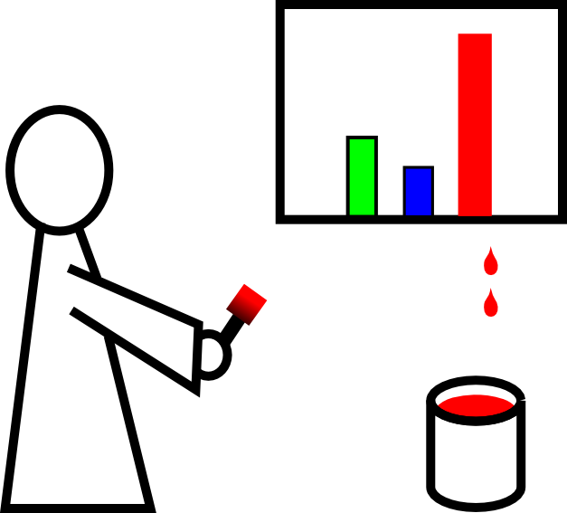

# The Lab: Tracking down scientific fraud

**Once upon a time** there was a normal molecular biology lab. But one day a PhD student made a discovery that became a research nightmare.. 

In [**The Lab: Avoiding Research Misconduct**](http://ori.hhs.gov/thelab), an interactive movie you can learn how to deal with dishonesty in science. You get a chance to walk in the shoes of a PhD student, a postdoc, a PI, and a research integrity officer to find out what is really going on. **The Lab**, created by the **Office of Research Integrity**, skillfully mixes movie, adventure, and didactic content. It is not a must-see. It is a must-do.
