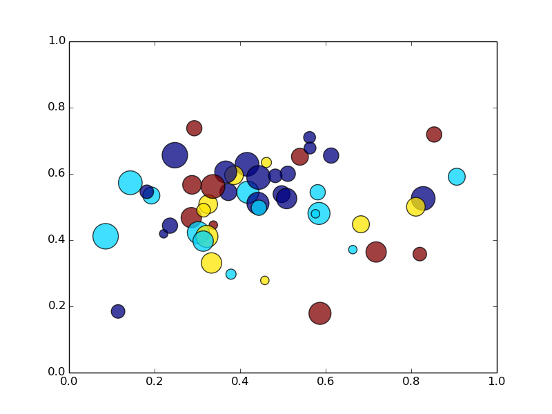
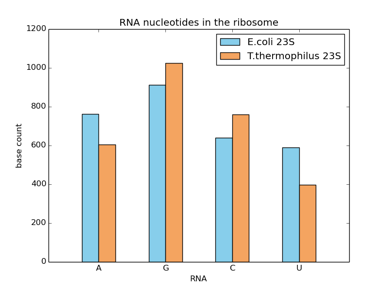
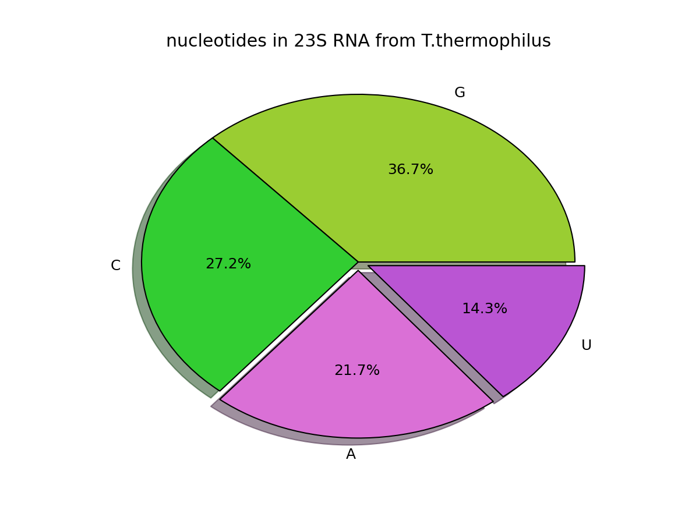

# Standard plotting examples for matplotlib

Without doubt, matplotlib is the most mature plotting library for Python. It is easily adaptable to create diagrams for publications, for the web and for your everyday data analysis. But often I found myself a bit lost in the huge vault of examples on the [matplotlib homepage](http://matplotlib.org). This is why I built my own collection of scripts to create standard diagrams.

Here are three of my favourites.

## The Scatterplot

The example uses random distributions to generate balls of different sizes. Both the different colors and transparency is optional. A beautiful application of this kind of plot are the data on demographics from the [Gapminder data set](http://www.gapminder.org/videos/population-growth-explained-with-ikea-boxes/), as presented by **Hans Rosling**.

    :::python
    # scatterplot example
    import math
    import random
    import matplotlib.pyplot as plt

    # prepare random data
    n_balls = 50
    x = [random.triangular() for i in range(n_balls)]
    y = [random.gauss(0.5, 0.15) for i in range(n_balls)]
    colors = [random.randint(1, 4) for i in range(n_balls)]
    areas = [math.pi * random.randint(5, 15)**2 for i in range(n_balls)]

    # draw the figure
    plt.figure()
    plt.scatter(x, y, s=areas, c=colors, alpha=0.75)
    plt.axis([0.0, 1.0, 0.0, 1.0])
    plt.savefig('balls.png')

## The Bar Chart

When creating multiple groups of bars, you need to adjust the x-values a bit to make the diagram look good (*in vertical bars, of course!*). Note that the left group of bars is shifted to the left, so that the label ends up exactly between the two bars. Also note that `matplotlib` determines the position of the legend box by itself.

    :::python
    # bar chart example
    from pylab import figure, title, xlabel, ylabel, xticks, bar, \
                      legend, axis, savefig

    nucleotides = ["A", "G", "C", "U"]

    counts = [
        [606, 1024, 759, 398],
        [762, 912, 639, 591], 
        ]

    figure()
    title('RNA nucleotides in the ribosome')
    xlabel('RNA')
    ylabel('base count')

    x1 = [2.0, 4.0, 6.0, 8.0]
    x2 = [x - 0.5 for x in x1]

    xticks(x1, nucleotides)

    bar(x2, counts[1], width=0.5, color="#87CEEB", label="E.coli 23S")
    bar(x1, counts[0], width=0.5, color="#F4A460", label="T.thermophilus 23S")

    legend()
    axis([0.5, 9.5, 0, 1200])
    savefig('barplot.png')

## The Pie Chart

The pie chart code illustrates third things: First, setting the image resolution in dpi (in the last line). Second, using the set of [140 named colours](http://www.mmimad.com/140colors.html)). Third, defining a custom function to generate the annotation inside the pie slices. 

    :::python
    # pie chart example
    from pylab import figure, title, pie, savefig

    nucleotides = 'G', 'C', 'A', 'U'
    count = [1024, 759, 606, 398]
    explode = [0.0, 0.0, 0.05, 0.05]

    colors = ["yellowgreen", "limegreen", "orchid", "mediumorchid"]

    def get_percent(value):
        '''Formats float values in pie slices to percent.'''
        return "%4.1f%%" % (value)

    figure()
    title('nucleotides in 23S RNA from T.thermophilus')

    pie(count, explode=explode, labels=nucleotides, shadow=True,
        colors=colors, autopct=get_percent)

    savefig('piechart.png', dpi=150)

## Also see:

Many more examples for plotting can be found in:

* [The matplotlib user guide](http://matplotlib.org/users/screenshots.html)
* [The matplotlib gallery](http://matplotlib.org/gallery.html)
* [The gallery for the seaborn extension](https://web.stanford.edu/~mwaskom/software/seaborn/examples/index.html)

