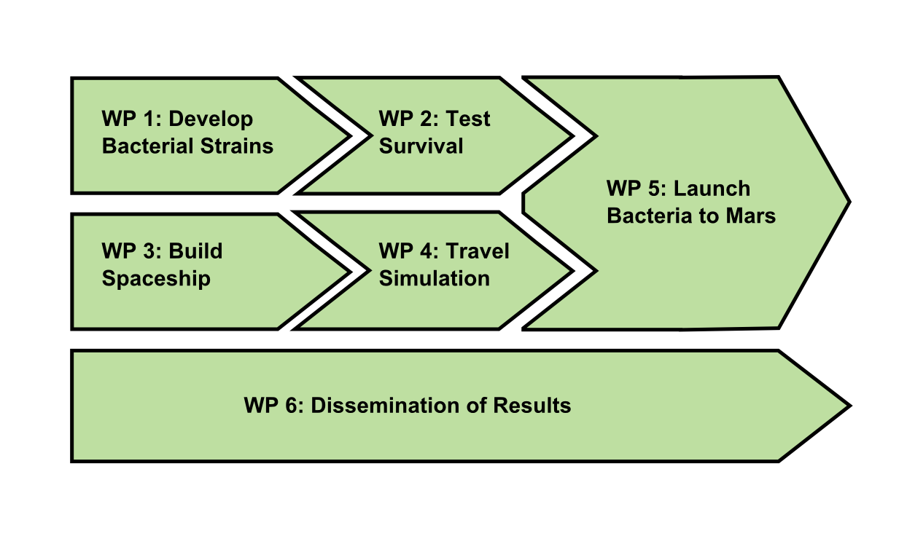

# PERT diagrams

**PERT diagrams** are a tool to display the logical organization of your project. You have probably seen PERT diagrams somewhere already. Now you also know hot to call them.

### How to create them?

Draw a diagram consisting of boxes, circles or other shapes. Each element represents a milestone, deliverable or work package in your project. Connect the boxes to indicate how the milestones of your project depend on each other. Good annotation by numbers and labels is key. 

### PERT charts in engineering

There exists a more narrow formal notation for PERT charts, showing circles connected by edges. This notation is commonly used in engineering, but it is less common in the context of scientific projects it is seldom found.

Originally, PERT charts were used in the Polaris project around 1953, where they helped to construct a nuclear submarine within a few years. 

### What are they good for?

PERT diagrams are useful to give an overview of a long-term project, e.g. in a grant application. The diagram allows you to identify the **critical path**, the longest piece of work that will delay the project if it gets delayed. Of course, the PERT chart is based on the assumption that you can design the project in a top-down manner. Once you are entrenched deep in a project, they are less useful for day-to-day planning. However, looking at the PERT may help you to find the overall direction again.

