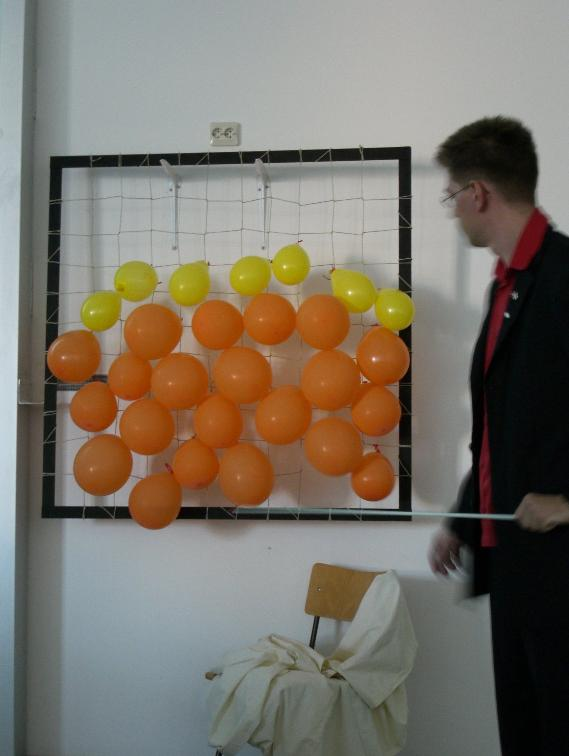

# The PhD Defence

I have seen PhD defences in four European countries. They all are initiation rituals by which the candidate proves that he is ready for the degree. Scientifically, when you get a date for the defence, there is not much that can go wrong. The referees have approved of your thesis, believe you'll make it, and a lot will have to happen to change their mind. 

So you are on the safe side, even if you give your defence talk half-heartedly, right? 

**Wrong.** Once you get the title, you will be on your own. This is what maturity is about. Nothing could spoil your start more than putting off your most important supporters: your supervisor, your committee, your audience. And they will remember. You will need these people later, whether you are planning to stay in science or not. 

Therefore, it is good to make sure your audience has something to remember. You may decide to call in all the bells and whistles. To my defence, I brought a painted protein structure, a balloon sculpture, and literally pulled a pigeon out of the hat. The talk itself was OK, but not brilliant. What made a difference was that I had prepared answers to the most probable questions. And I hope the audience forgave me when I mixed up plus and minus in one of them. 

You may try something unorthodox, but most of all: Do your homework: Prepare, prepare, prepare.

**Take the ritual seriously. Be worthy of the title.**
