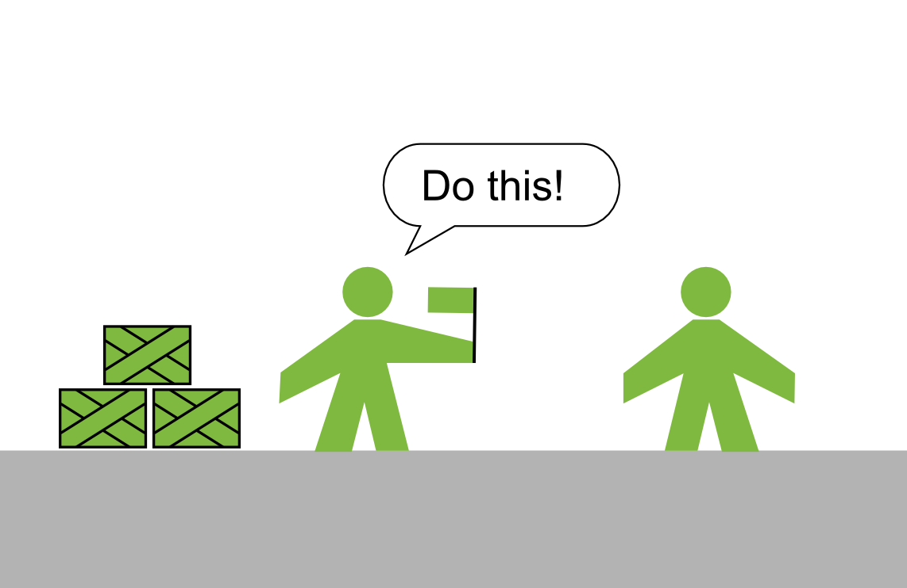
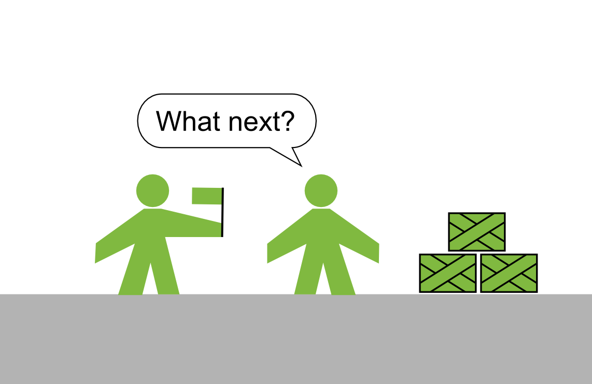

# Push vs. Pull Leadership

Most approaches to management can be described by one of two models: **push or pull**

### Push systems

You tell people what to do. You set a deadline. They execute. A push system fosters discipline. The main driving force for people in a push system is pressure (goals, expectations, deadlines). In a push system you typically find 

* detailed top-down plans
* GANTT charts
* contingency plans

The push approach helps you to achieve a goal when everything else is secondary.

### Pull systems

You ask people what needs to be done. You review progress after some time. People do what they think is reasonable. A pull system fosters creativity and improvement. The main driving force in a pull system is intrinsic motivation (passion, ambition, purpose). In a pull system you typically find

* facilitators
* learning culture
* lean management tools like **Kanban**

The pull approach helps you to develop people when everything else is secondary.

### Conclusion
**Wait a moment!** I need to grow great scientists **and** meet my deadlines! 

It's a model. The model helps you to be more aware of what you are doing. Reality is about balance. You didn't expect to learn everything about leadership in two figures, did you :-)?

