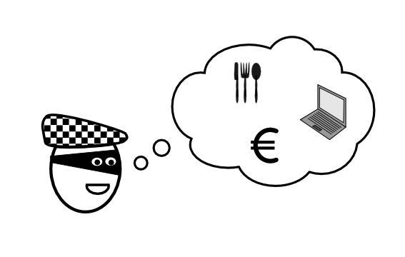

# Coding Challenge: The Backpack Problem

### The Challenge

A burglar has broken into a house. He finds a lot of valuable items worth taking. Unfortunately, his backpack is too small to take everything. 

Write a program that selects items to put in the backpack.

Our burglar is a seasoned professional, so he can estimate the market value of each item precisely. Each item has a size and a value:

| item | size | value |
|------|------|-------|
| laptop | 2  | 600,- |
| silver cutlery | 2 | 400,- |
| stereo | 3  | 300,- |
| jewellery | 2 | 1100,- |
| vase | 5 | 700,- |
| camera | 2 | 500,- |
| painting | 4 | 900,- |
| cash | 1 | 800,- |

The backpack has a size of `8`.

When your program produces at least one solution worth `3000`, you have mastered this challenge.

### What you can practise in this coding challenge

* dynamic programming

### Pseudocode of the backpack algorithm

1. Create a list that will contain the best combination of items for a given backpack size
2. Insert an empty combination for backpack size 0.
3. Start with a backpack of size 1.
4. Set the best combination for current size-1 as the candidate for the best combination for the current size.
5. Go through the items
6. Create a combination of this item plus the best combination from size (current size size of the current item).
7. If this combination is more valuable than the candidate combination, replace the candidate combination by this one.
8. Increase the current backpack size by 1.
9. Go back to step 4 until you reach the desired size.
10. Give back the best combination for the desired backpack size.

