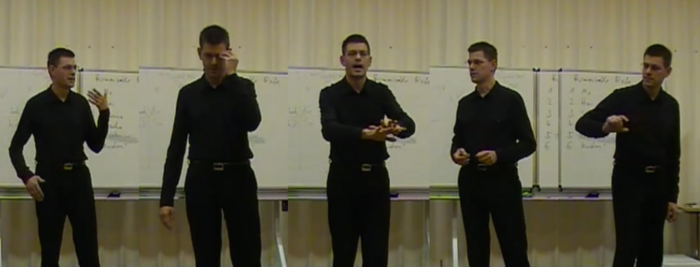

# Public Speaking Clubs in Berlin

*Scences from a rehearsal speech at a speaking club*

Recently, a couple of friends and I laid the groundworks for a new speaking club, the **Redesalon** in Berlin-Schöneberg. It is not the first of its kind. In fact, there are many clubs where people meet to rehearse and improve their speaking skills. As long as our **Redesalon** is not present online, here are a few other places to go:

----

## The Bear - Storytelling

[The Bear](http://thebear-storytelling.de/) hosts a monthly series of storytelling events created by *Dyane Neiman*. Everybody is invited to contribute a five-minute story on the topic of the evening. Stories are in English or German.

----

## Spektrum Redner

[Spektrum Redner](http://spektrum-redner.de/) is a speaking club in Berlin targeted at shy and people with Aspberger, created by *Sascha Goldmann*. It is meeting biweekly in the [Nachbarschaftsheim Friedenau](http://www.nbhs.de). Meetings are in German.

----

## Pecha Kucha

The Berlin branch of [Pecha Kucha](http://pechakucha.de/berlin/) offers a special speech challenge: **20 slides** that change automatically every **20 seconds**. Speeches are given in German and English.

----

## Toastmasters International

[Toastmasters](http://www.toastmasters.org) is a large US-based speaking network. The clubs meet regularly for [speech contests](http://www.divisionc.de/) and other events. There are multiple franchises in Berlin

* [Adlershof Toastmasters](http://adlershof-toastmasters.de/)
* [Berliner Redekünstler](http://www.berliner-redekuenstler.de)
* [Berliner Rhetorikmeister](http://berliner-rhetorikmeister.de)
* [Berliner Meisterredner](http://www.meisterredner.org)
* [First Berlin Toastmasters](http://www.fbtm.org)
* [Mercury Toastmasters](http://www.mercury-toastmasters-berlin.de)
* [Spreeredner](http://www.spreeredner.de)
* [Steglitz Toastmasters](http://www.steglitz-toastmasters.de)

----

## Streitkultur

[Streitkultur e.V.](http://streitkultur-berlin.net/) is running public **debates**. Debates are run by teams, usually a pro and con team. In addition to the speaking skills, content of the speeches is evaluated.

----

## Debating Union

The [Berlin Debating Union e.V.](http://www.debating.de/) is running debates in German and English. Besides regular team debating events they are also organizing **debating contests**.

----

## Science Slam

If you are a scientist, the [Science Slam](http://www.scienceslam.de/) event series is for your peer group to make science more understandable and entertaining as reasonably possible.

----

## Meeet

Finally, the [Meeet](http://meeet.de/) coworking space organizes regular events on personal development and business skills. Most events and workshops are in German. *Frank and Carola* have a reputation as extremely nice hosts!
